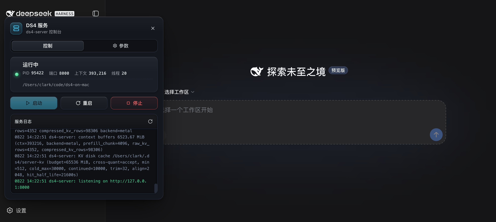
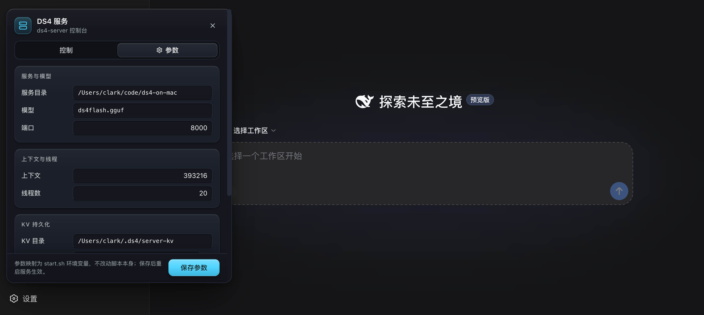
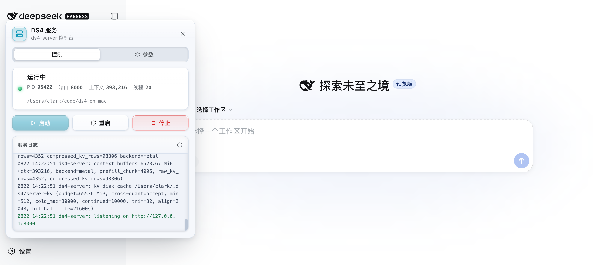
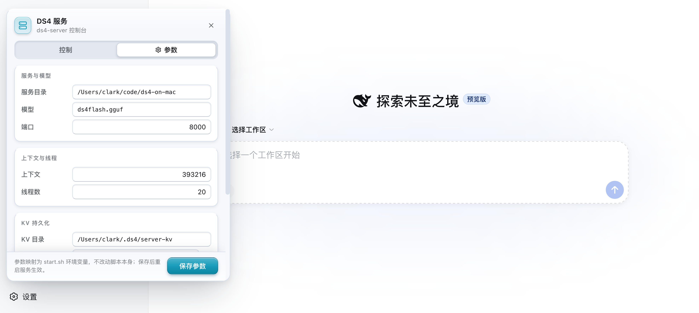

# dsh-ds4-service 🛰

DeepSeek Harness **DS4 服务控制插件**：在 Web GUI 侧栏一键**开启 / 重启 / 关闭** ds4-server，并可视化配置 `start.sh` 的全部启动参数。插件**自带 ds4-server 二进制与启动脚本**（`assets/`），可部署到任意目录实现完全自包含，默认直接驱动 `~/code/ds4-on-mac` 项目。纯 Node.js 实现，无运行时依赖。

一句话：`DS4 服务面板 → 改参数 → 保存 → 启动/重启/停止`，全程不手敲命令行、不改动你手调的 start.sh。

## 界面预览

截图均取自真实 GUI（ds4-server 运行中状态）。面板跟随 DSH 通用设置的深浅主题**即时切换，无需刷新页面**：

| 深色 · 控制页 | 深色 · 参数页 |
| :---: | :---: |
|  |  |

| 浅色 · 控制页 | 浅色 · 参数页 |
| :---: | :---: |
|  |  |

## 功能总览

| 类别 | 能力 |
| --- | --- |
| 🚀 服务控制 | 侧栏「DS4 服务」入口 + 面板内 **启动 / 重启 / 停止** 按钮，实时状态点（绿=运行 / 灰=停止 / 红=上次失败） |
| ⚙️ 参数可视化 | 表单配置 start.sh 全部参数：模型、端口、上下文、线程、KV 目录/上限、DSpark 配套模型、预热权重等 |
| 📜 实时日志 | 面板内滚动查看 `serviceDir/logs/ds4-server.err|.log`，自动滚底、成功/失败行着色 |
| 🌗 深浅双模式 | 完整跟随 DSH 通用设置的 深色 / 浅色 / 跟随系统，即时切换无需刷新 |
| 🎛 启动着色器动效 | 点击「启动」播放 WebGL CSS-to-Shader 动效（CRT/色差/故障/光环），全浏览器降级兼容 |
| 📦 自带资产 | 插件携带 `assets/ds4-server` 二进制 + `assets/start.sh` + `assets/download.sh` 模型下载脚本；`deployAssets=true` 时自动部署缺失的 serviceDir |
| 🔒 安全围栏 | CSRF / DNS 重绑定防护、并发互斥、白名单校验、无 shell 注入面 |
| 🔌 HTTP API | 状态 / 配置读写 / 控制 / 日志 四个路由，GUI 全部通过它们工作 |

## 项目结构

```
dsh-ds4-plugin/
├── package.json          # dsh.bundle.patch + dsh.client 声明
├── cordis.patch.yml      # bundle 补丁：把插件插入 profile 组合树
├── index.js              # 服务端（Node）：服务控制 + 状态检测 + HTTP 路由 + 安全守卫
├── client.js             # 客户端（React）：侧栏入口 + 控制面板（双主题 UI）
├── config.json           # 运行配置（GUI 保存写回这里）
├── config.example.json   # 配置模板（含逐项 _comment）
├── docs/                 # README 界面截图（深/浅主题 × 控制/参数页）
├── assets/
│   ├── ds4-server        # 自带的 ds4 二进制（arm64）
│   ├── start.sh          # 自带的启动脚本（与项目里手调版同源）
│   └── download.sh       # 模型下载脚本（hf-mirror/aria2c，断点续传 + sha-256 校验）
└── test/
    ├── guard-test.mjs    # 安全守卫攻击矩阵（11 用例）
    └── render-smoke.mjs  # 客户端组件树渲染冒烟
```

## 如何工作

插件**不修改**你的 `start.sh`。该脚本本身所有参数都支持环境变量覆盖（`MODEL`/`PORT`/`CTX`/`THREADS`/`KV_DIR`/`KV_SPACE_MB`/`MTP`/`DSPARK`/`WARM`），插件只把 `config.json` 里的配置映射成这些环境变量再调用 `start.sh <start|stop|restart>`。因此：

- 你手调的 start.sh 注释、A/B 调优记录、日志/pid 位置全部原样保留；
- GUI 改参数 → 保存到 `config.json` → 重启服务即用新参数生效；
- 服务状态以**进程表扫描**为准（pid 文件只作加速）：发现活进程但 pid 文件缺失/陈旧时自动回写自愈；
- **启动幂等**：已在运行时点「启动」直接返回成功（PID 不变），不会重复拉起被二进制单例锁拒绝；
- **停止彻底**：`start.sh stop` 之后插件再扫描并清理残留的 ds4-server 孤儿进程（start.sh 的 `pkill -f "ds4-server -c"` 匹配不到实际命令行 `./ds4-server -m ... -c ...`，杀不掉孤儿——孤儿会让下次启动被单例锁拒绝）。

## GUI 使用

侧栏底部「DS4 服务」入口（SVG 图标 + 状态点：绿=运行 / 灰=停止 / 红=上次失败）→ 打开面板，分两个标签页：

**控制页**
- **状态卡**：脉冲状态点 + 运行中/已停止 + 键值行（PID / 端口 / 上下文 / 线程，等宽字体）+ 服务目录路径
- **操作按钮**：▶ 启动（primary，点击触发[启动着色器动效](#启动着色器动效css-to-shader)）/ 🔄 重启（outline）/ ⏹ 停止（destructive）；按状态机启停用（运行中禁用启动，已停止禁用重启/停止），执行中显示 spinner
- **内联提示**：成功/失败/进行中三种样式，保存参数后附「立即重启」快捷按钮
- **日志卡**：终端风格（等宽、自动滚底、成功/失败行着色、随主题切换底色）+ 刷新按钮

**参数页**
- 配置按 Card 分组：服务与模型 / 上下文与线程 / KV 持久化 / DSpark 与预热
- 路径类字段用等宽字体；DSpark/预热用 Switch 开关；数字字段带单位
- 底部 sticky 保存条：保存参数（写回 `config.json`，白名单校验）

> 参数保存后需**重启服务**才会用新值生效。

---

## 设计体系（借鉴 [shadcn/ui](https://ui.shadcn.com/docs/theming)）

UI 遵循 shadcn/ui 的设计方法论落地。它不是组件库的搬运，而是一套可移植的**分层约定**：

### 1. 语义 Design Token（组件永不写死颜色）

shadcn 的核心思想：所有颜色抽象成语义变量（`--background`/`--card`/`--muted`/`--border`/`--primary`/`--destructive`…），组件样式只引用 token。换主题 = 只换 token 定义，组件规则一行不动。

本插件映射为（DSH 主题别名优先，`var()` 第二参数是独立使用时的回退值）：

```css
.ds4-panel {
  --ds4-bg:     var(--dsw-alias-surface-1, #f7f9fc);  /* 应用基底 */
  --ds4-card:   var(--dsw-alias-surface-2, #ffffff);  /* 卡片=亮一档(海拔感) */
  --ds4-fg:     var(--dsw-alias-label-primary, #1a2333);
  --ds4-muted:  var(--dsw-alias-label-secondary, #5a677d);
  --ds4-subtle: var(--dsw-alias-label-tertiary, #8a94a8);  /* 三级文字 */
  --ds4-border: var(--dsw-alias-border-subtle, #dde4ee);
  --ds4-primary:var(--dsw-alias-accent, #0aa2c0);
}
```

### 2. 组件解剖（Component Anatomy）

- **Card**：`border + bg-card + rounded-xl + shadow-sm`，内部拆 header（title semibold + description muted）/ content / action 槽位。本插件的分组卡、状态卡、日志卡都是这个骨架。
- **Button variant 体系**（等价 cva 的 variants）：`primary`（实色+投影）/ `outline`（描边）/ `destructive`（红描边）/ `ghost`（图标钮）。统一规格：高度、`gap`、`font-medium`、`disabled:opacity .45`、`focus-visible` 焦点环。
- **Switch** 替代 checkbox：胶囊轨道 + 滑块，选中态轨道变 primary——布尔配置的现代表达。
- **分段式 Tabs**：凹槽轨道 + 凸起选中片，比下划线式更适合二选一的主导航。
- **Badge 语义**：状态点用小圆点 + 颜色编码（绿=运行 / 灰=停止 / 红=失败），不占版面。

### 3. 立体感技法（模拟「光从上方来」）

| 手法 | CSS |
| --- | --- |
| 受光顶边 | `border-top-color` 提亮 + `inset 0 1px 0 rgba(255,255,255,…)` 顶部高光 |
| 表面渐变 | `linear-gradient(180deg, 白高光 → 本色)`，卡片/按钮/选中 Tab |
| 三层投影 | 远景弥散 + 近景锐利 + inset 高光（面板外壳） |
| 凹槽（well） | `inset 0 1px 3px 深色`——Tabs 轨道、输入框、Switch 轨道 |
| 按压物理反馈 | `:active { transform: translateY(1px) }` + 阴影翻转为内凹 |
| 下沉式终端 | 日志卡整体 `inset 0 2px 8px`，像嵌进面板的屏幕 |
| 毛玻璃 | sticky 保存条 `backdrop-filter: blur(8px)` |
| 状态点光晕 | 径向渐变小球（左上高光）+ `drop-shadow` + ping 脉冲动画 |

### 4. 可访问性细节

- 全部可交互元素带 `:focus-visible` 焦点环（2px 半透明 primary）；
- Switch 用 `role="switch"` + `aria-checked`；
- Tabs 用 `role="tablist"/"tab"`；
- 图标 `aria-hidden`，文字承载语义。

---

## 启动着色器动效（CSS-to-Shader）

点击「启动」时面板上会播放一段 WebGL 着色器动效，技术路线学习自 [html-in-canvas.dev 的 CSS-to-Shader 案例](https://html-in-canvas.dev/demos/css-to-shader/)（DOM → canvas 纹理 → 片元着色器）：

```
纹理源 ──→ 2D 画布(stage) ──→ WebGL 纹理 ──→ 片元着色器 ──→ 面板区域上的 overlay
```

**片元着色器**（GLSL，逐像素）叠加了案例中的多个预设技法：

| 效果 | 技法 |
| --- | --- |
| CRT 弧形失真 | `uv += dc * dot(dc,dc) * k`（crt 预设） |
| 故障块位移 | 按行分块 + 随机门控的水平位移（glitch 预设） |
| 径向色差 | 从点击坐标向外 RGB 分裂（chromatic 预设） |
| 扫描线 / 磷光闪烁 | 子像素正弦 + 时间抖动（crt 预设） |
| 暗角 | 距中心平方衰减 |
| 点击光环 | 从启动按钮位置扩散的光环（案例 `spawnRipple` 的着色器化） |
| 上电白闪 + 扫描光带 | 开场 CRT 通电感 / 周期扫描线 |

**纹理源**双路径：

- **Chromium 147+**（开 `canvas-draw-element`）：`drawElementImage()` 逐帧绘制真实面板 DOM 作为纹理——与原案例同款管线，HUD 浮在实时界面之上；
- **其余浏览器**：程序化绘制的 boot HUD（DS4 标题 + 闪烁光标 + 逐行启动日志 + 进度条 + 均衡器，布局借鉴案例的 Controls/Visual 源场景），颜色从面板 `--ds4-*` token 读取，**深浅主题自动带入**。

**降级**（动效是纯增强，绝不影响功能）：`prefers-reduced-motion` → 跳过；WebGL 不可用 / 着色器编译失败 → 静默跳过；`webglcontextlost` → 立即收场清理（`WEBGL_lose_context` 释放上下文）；面板关闭 → 矩形消失即停；请求超过 16s → 安全收场（服务预热最长 2 分钟，消息条仍持续显示进度）。

---

## 深浅双主题机制（对齐 DSH 外观管理）

### DSH 的主题管线（本插件如何挂接）

阅读 DSH 前端源码（`dsh-client-ui-theme` + `dsh-client-ui-layout`）得到的机制：

```
通用设置(深色/浅色/跟随系统)
   │  写入 ~/.dsh/settings.yaml 的 ui-theme.preference
   ▼
ThemeRuntime（ui-theme 包）
   │  • preference=system 时监听 matchMedia('(prefers-color-scheme: dark)')
   │  • OS 明暗切换 → 实时重新解析 active 主题
   │  • 发布 theme/change 事件，携带快照 { preference, active: { colorScheme, tokens } }
   ▼
ThemePresenter（ui-layout 包）——把快照落到 DOM：
   • document.documentElement.style.colorScheme = 'dark' | 'light'
   • 深色：<body> 加 data-ds-dark-theme 属性；浅色：移除该属性
   • 把 --dsw-alias-* 主题别名变量写到 body 的 inline style
```

**关键结论**：`body[data-ds-dark-theme]` 是深色模式的权威 DOM 标记，且 `system` 偏好下 OS 切换会实时增删它。

### 插件的接入方式：属性驱动的双套 token

所有颜色与立体效果定义为双套 CSS 变量——**默认浅色，深色属性下覆盖**：

```css
/* ① 浅色（默认） */
.ds4-panel, .ds4-launch {
  --ds4-panel-shadow: 0 32px 64px -16px rgba(30,41,59,.28), …;
  --ds4-log-bg: #f2f5fa;
  /* …共 65 个 */
}

/* ② 深色覆盖：GUI 切深色时 body 带 data-ds-dark-theme，级联自动生效 */
body[data-ds-dark-theme] .ds4-panel,
body[data-ds-dark-theme] .ds4-launch {
  --ds4-panel-shadow: 0 32px 64px -16px rgba(0,0,0,.6), …;
  --ds4-log-bg: #0b0e13;
}
```

组件规则**只引用 token**，因此：

- DSH 切 深色/浅色/**跟随系统** → body 属性变化 → 插件界面**即时跟随，连页面刷新都不需要**；
- 双套 token 严格对称（当前 65 ↔ 65，校验脚本保证无缺失/多余）；
- 基础色优先引用 `--dsw-alias-*`（GUI 换皮肤时连具体色值都跟着皮肤走），仅立体效果色由插件自己定义两套。

### 深浅两套的取值策略

| 类别 | 浅色 | 深色 |
| --- | --- | --- |
| 投影 | 柔和蓝灰 `rgba(30,41,59,…)`,低不透明度 | 纯黑多层，高不透明度 |
| 高光 | 白 `.85`（明显受光） | 微白 `.06`（克制） |
| 凹槽 | 灰蓝 `rgba(148,163,184,.18)` | 深黑 `.25+` |
| 语义色文字 | 加深（`#157a4a`/`#dc2626`）保证浅底可读 | 提亮（`#4ce0a1`/`#f87171`）保证深底可读 |
| 日志卡 | 浅底 `#f2f5fa` + 深字 | 深底 `#0b0e13` + 浅字（终端语义） |

---

## HTTP 路由

| 路由 | 用途 |
| --- | --- |
| `GET /plugin-api/ds4/status` | 运行状态 / 命令行 / 最近日志 / 配置快照 |
| `GET/POST /plugin-api/ds4/config` | 读/写配置（白名单校验、持久化到 config.json） |
| `POST /plugin-api/ds4/control` | `{action: start\|stop\|restart}` 控制服务，返回执行输出 |
| `GET /plugin-api/ds4/logs?lines=N` | 读取最近 N 行服务日志 |

## 安全

插件路由自带请求来源围栏（dsh 的 webServer 只按路径分发，不做 Host/Origin 校验）：

- **Host 必须在允许清单**（回环 + 服务器绑定地址 + `webRuntime.trustedHosts` 的 LAN IP/受信主机），挡住 DNS 重绑定；
- **`Sec-Fetch-Site: cross-site` 直接拒绝**（浏览器原生标注，不可伪造）；
- **带 `Origin` 时必须同源**（`Origin: null` 拒绝），挡住跨站 CSRF——包括 `text/plain` 简单请求绕过预检的变体；
- 两个头都没有（curl 等非浏览器客户端）放行；
- 控制路由并发互斥（进行中返回 409）；请求体上限 64KB；配置字段白名单校验；
- 响应带 `Cache-Control: no-store` 与 `X-Content-Type-Options: nosniff`；`config.json` 以 0600 权限写入；
- 子进程一律 `spawn` 参数数组（不经 shell），start.sh 内所有变量展开均加引号，无注入面；
- 进程识别正则要求 `ds4-server` 后紧跟 flag（`-m`/`--port`），避免误杀 `less`/`grep` 类进程。

攻击矩阵与回归见 `test/guard-test.mjs`（11 用例）、`test/render-smoke.mjs`。

## 配置项（config.json）

| 字段 | 说明 |
| --- | --- |
| `serviceDir` | 服务运行目录；默认 `~/code/ds4-on-mac`。设成空目录时插件自动部署自带二进制+脚本，实现完全自包含 |
| `model` | 模型文件，默认 `{{assets}}/DeepSeek-V4-Flash-0731-Abliterated-DS4-Quality128.gguf`。三种写法：相对 serviceDir、绝对路径、`{{assets}}` 占位符（=插件 assets 目录，`assets/download.sh` 下载后即指向它） |
| `port` | 监听端口，默认 `8000` |
| `ctx` | 上下文长度 `-c`，默认 `393216`（reasoning_effort=max 需要） |
| `threads` | 主机辅助线程 `-t`，默认 `20` |
| `kvDir` | `--kv-disk-dir` KV 持久化目录 |
| `kvSpaceMb` | `--kv-disk-space-mb` 上限 MB，默认 `65536` |
| `mtp` | DSpark 配套模型 `--mtp`，默认 `{{assets}}/…-DSpark-support.gguf`；留空禁用（下载: `assets/download.sh --dspark`） |
| `dspark` | 启用 `--dspark` 投机解码，默认 `false`（M2 Ultra 实测更慢） |
| `warm` | 启用 `--warm-weights` 预热映射页，默认 `true` |
| `deployAssets` | 缺资产时自动部署自带二进制+脚本，默认 `true` |
| `logLines` | 日志面板默认行数 |
| `statusPollMs` | GUI 状态轮询间隔 |

完整逐项说明见 [`config.example.json`](config.example.json) 的 `_comment`。

## 安装

前置：本机已构建好 `ds4-server`（本项目已自带一份于 `assets/`，也可用你构建的版本替换）。

```bash
cd ~/code/dsh-ds4-plugin
# 用你自己的构建替换自带二进制（可选）
# cp ~/code/ds4-on-mac/ds4-server assets/ds4-server

# 安装进 web profile（本地链接）
pnpm --dir ~/.dsh/profiles/web add --link ~/code/dsh-ds4-plugin
```

或者手动把依赖和 bundle 加进 `~/.dsh/profiles/web/package.json`：

```json
{
  "dependencies": {
    "dsh-ds4-service": "link:~/code/dsh-ds4-plugin"
  },
  "dsh": { "profile": { "bundles": [ "...", "dsh-ds4-service" ] } }
}
```

然后 `pnpm --dir ~/.dsh/profiles/web install`。包声明 `dsh.bundle.patch`（服务端）+ `dsh.client`（Web 客户端），重启 `dsh web` 后侧栏出现「DS4 服务」入口。

> 开发迭代：`client.js` 由服务器实时从磁盘分发（`no-cache`），**刷新页面即生效**；`index.js`（服务端）改动需重启 `dsh web`。

## 模型下载（assets/download.sh）

默认配置的 `model`/`mtp` 指向 `{{assets}}/`（= 插件 `assets/` 目录），模型用自带脚本下载到那里即可，**无需任何手工符号链接**：

```bash
cd ~/code/dsh-ds4-plugin/assets

./download.sh              # 只下主模型（~96 GB，默认配置指向它）
./download.sh --dspark     # 主模型 + DSpark 配套模型（另 ~6.8 GB，开 dspark 才需要）
./download.sh --force      # 跳过磁盘剩余空间检查
```

| 特性 | 说明 |
| --- | --- |
| 下载源 | 默认 `https://hf-mirror.com`（国内镜像）；海外直连 `HF_ENDPOINT=https://huggingface.co ./download.sh` |
| 引擎 | `aria2c` 优先（8 线程分块 + 下载完内联校验）；未安装回退 `curl -C -` 单线程续传（`brew install aria2` 加速） |
| 校验 | 内置 sha-256（主模型 `2cfc36b7…`，配套 `cd8593a2…`），curl 模式下到 `.part` 校验通过才改名，杜绝半截文件 |
| 续传 | 两引擎都支持断点续传，中断后重跑脚本即可继续 |
| 幂等 | 已完整存在且校验标记通过的文件自动跳过（避免每次重算 96GB 哈希） |
| 空间检查 | 启动前比对 `df` 剩余空间（主模型 + 可选配套），不足即拒绝，`--force` 可越过 |
| 入库隔离 | 下载产物被 `.gitignore` 排除（`assets/*.gguf` 等），不会被误提交 |

仓库：`apetersson/DeepSeek-V4-Flash-0731-Abliterated-DS4-Quality128`。

> 已有 `~/code/ds4-on-mac/gguf/` 下的模型？不必重复下载——把 `model` 改回 `ds4flash.gguf`（相对 serviceDir）或绝对路径即可，两种写法都支持。

## 开发与测试

```bash
node test/guard-test.mjs    # 安全守卫攻击矩阵（CSRF/重绑定/并发等 11 用例）
node test/render-smoke.mjs  # 客户端组件树渲染冒烟（两标签页 × 各类消息状态）
```

`index.js` 导出 `internals`（getStatus/doStart/doStop/doRestart/buildAllowedAuthorities/requestTrusted 等），供测试与诊断直接调用。

## 常见问题

- **改参数后不生效**：需重启服务。停止 → 启动，或直接点「重启」。
- **想控制别的项目/全新目录**：把 `serviceDir` 指向它；若该目录没有 `start.sh`/`ds4-server`，插件会自动把自带资产部署过去。
- **模型路径**：相对路径相对于 `serviceDir`；跨项目请用绝对路径。
- **点启动报 already running**：已被新版修复（启动幂等 + 孤儿清理）。若仍出现，说明有 pid 文件之外的残留进程，插件停止操作会自动清掉它。

## License

[MIT](LICENSE)
